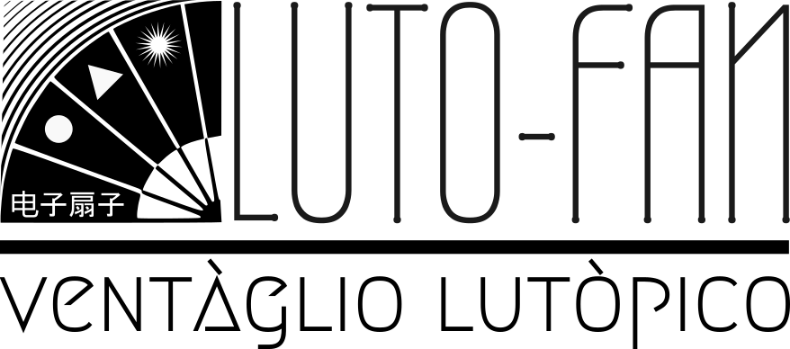
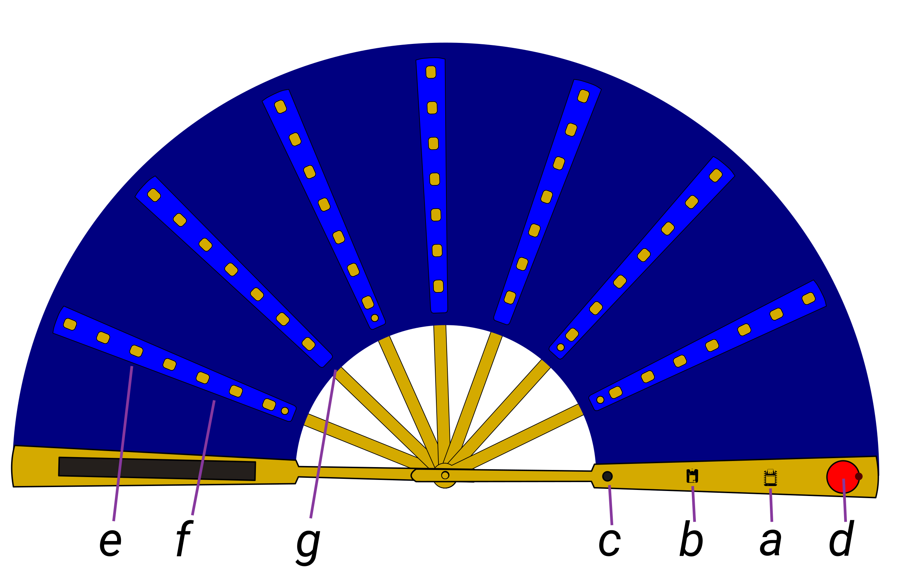

# lutofan
First Generation and prototype of the Lutòpian Fan aka Ventaglio Lutòpico aka 电子扇子 (diànzǐ shànzi)

## Abstract (long)

The project is the result of a journey that began a few years ago when I started installing solar-powered Meshtastic nodes at [transformational festivals](https://www.lutopia.art/the-ozorian-experiment/). This subsequently led me to speak about the need for more decentralized and democratic communication at various events (including the [Fusion Festival](https://www.seeedstudio.com/blog/2025/07/21/cyberpunk-communication-protocols-at-fusion-festival-a-report/?), Ozora, and [FOSDEM](https://fosdem.org/2026/schedule/event/KUZUWX-off-grid_communication_cyberpunk_and_autonomy/)). 

But the idea (the epiphany) for the Lutòpian Fan struck me suddenly at the end of July last year, and it grew within me as I added (or often subtracted) ideas, uses, modularity, and symbolism. 

## Project Overview

`lutopian-fan` is a hardware design and documentation project exploring a new kind of connected, modular hand fan.

The project reimagines the traditional hand fan as a portable, multi-purpose smart object: lightweight, expandable, and designed for real-world outdoor, creative, and community use cases.

The prototype is built around the idea of combining a familiar physical object with modern embedded electronics, wireless mesh communication, local interaction, visual feedback, and future expansion possibilities.

This repository is intended to document the concept, design direction, prototype evolution, and visual material of the project.

## Concept

The fan is designed as a modular platform rather than a single-purpose device.

At a high level, the system includes:

<ol type="a">
  <li>a compact embedded controller (Seeed XIAO nRF52840 Sense Plus)</li>
  <li>long-range mesh communication through Meshtastic-compatible hardware Wio-SX1262 (LoRa)</li>
  <li>local user interaction (joystick) </li>
  <li>a low-power visual interface and mic </li>
  <li>visual feedback through integrated lighting </li>
  <li>optional sensing and expansion features </li>
  <li>a physical structure designed around modularity and portability </li>

</ol>

The goal is to create a device that can act as both a functional object and a communication tool, while keeping the design open to future modules (**also from third parties**) and use cases

## Meshtastic Compatibility

This project is designed to run Meshtastic firmware and to integrate with the Meshtastic ecosystem.

Meshtastic provides the open-source mesh communication layer used by the device. This repository focuses on the hardware concept, prototype documentation, visual design direction, and system integration around that firmware.

## Design Direction

The design explores the intersection of:

* wearable and portable technology
* low-power communication
* mesh networking
* physical interaction
* modular hardware
* speculative everyday objects
* audio journaling tool
* outdoor and festival-oriented tools
* emergency and off-grid communication scenarios

The fan format was chosen because it is simple, recognizable, portable, and culturally familiar, while also offering an unusual physical platform for electronics, interaction, and communication.

## Prototype Goals

The current prototype aims to demonstrate:

* a portable Meshtastic-compatible device
* a physical compass to point at friends
* a modular physical structure
* a compact and expressive user interface
* a lightpainting tool
* a visually recognizable product concept
* a platform that can be expanded through future modules, aslo called generations (to be explanded)

The project is currently in development and may evolve through different mechanical, electronic, and interface iterations.

## Possible Use Cases

Potential use cases include:

* creating airflow \o/
* everyday carry mesh communication
* festival and outdoor communication
* off-grid community tools
* interactive wearable objects
* experimental communication devices
* artistic and educational prototypes
* modular hardware development

## Repository Contents

This repository may include:

* project overview and documentation
* concept images
* prototype photos (to be addedd soon)
* visual references (explanding)
* non-confidential design notes
* high-level architecture notes
* build progress updates
* demo material (to be addedd as soon as we have the prototypes)
* links to related resources

Detailed production files, internal mechanical solutions, manufacturing-ready design files, and protected design information may be omitted or shared only in limited form.

## Development Status

The project is currently under active development.

The repository may be updated with:

* new prototype photos
* revised design notes
* demonstration videos
* functional test results
* assembly notes
* competition submission material

## License and Intellectual Property

This repository is published for documentation, evaluation, and promotional purposes only.

The project is designed to run Meshtastic firmware, which is distributed under its own open-source license.

Unless explicitly stated otherwise, all original photos, videos, text, visual materials, product concepts, mechanical design, hardware design, enclosure design, and the multi-purpose functionality of this device are © 2026 Davide Gomba. All rights reserved.

No license is granted to copy, modify, manufacture, sell, redistribute, or commercially exploit the hardware design, mechanical design, product concept, enclosure design, visual materials, or any protected functionality described or shown in this repository.

No patent license, hardware license, design license, or trademark license is granted by this repository.

Patent pending.

## Credits

Project by Davide Gomba, with the hardware and experience support of Peter Pan.   
Thanks to my son Djibril for the advices. 

Built for the Meshtastic Build-Off 2026.

